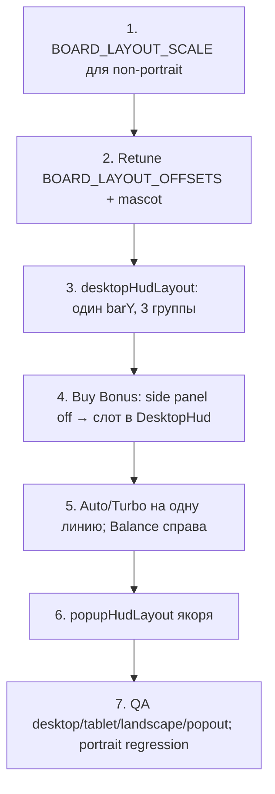

# Cat Mafia — план layout (non-phone)

Дата: 2026-07-24  
Референс: скриншот целевого desktop-расположения (единая нижняя полоса HUD).

---

## Скоуп и жёсткие ограничения

| | |
|--|--|
| **Где применяем** | Все layout’ы **кроме телефона (portrait)**: `desktop`, `tablet`, `landscape`, Stake popout L/S |
| **Где НЕ трогаем** | `portrait` — текущий phone HUD / buy-under-board / маскот остаются |
| **Что меняем** | Только **размеры и позиции** существующих элементов |
| **Что НЕ меняем** | Арт, стили кнопок, шрифты, иконки, форма Spin/Auto/Buy Bonus, дизайн balance/bet текста |

Существующие компоненты и ассеты остаются; пересобираем координаты/scale в layout-слое.

---

## Целевой layout (референс)

Одна горизонтальная полоса снизу, элементы выровнены по одной baseline. Spin — якорь по центру под доской.

```
[ i ] [ ☰ ] [ BUY BONUS ]      [ − ] [ SPIN ] [ + ]      [ AUTO ] [ ⚡? ]     BALANCE / BET
 ← left group →                ← center cluster →       ← right group →
```

| Группа | Элементы | Позиция |
|--------|----------|---------|
| Left | Info, Menu, **Buy Bonus** | Низ-слева; Buy Bonus **в ряду HUD**, не слева от доски |
| Center | −, Spin, + | По центру под доской; Spin крупнее −/+; все на одной линии |
| Right | Auto (+ Turbo*), Balance / Bet | Низ-справа; Auto **рядом** со Spin-кластером, не под ним |

\* Turbo есть в текущем HUD и на референсе не показан. **Дизайн не меняем** — оставляем кнопку, ставим в right group рядом с Auto (или сразу после Auto). Решение зафиксировать при имплементации, но элемент не удалять.

### Доска + маскот (non-phone)

| Элемент | Цель |
|---------|------|
| Доска | Крупнее, чем сейчас; визуально доминирует в центре / чуть левее центра |
| Вертикаль | Верхние ⅔ кадра; явный зазор до HUD (~24–48 CSS px) |
| Маскот | Справа от доски, высота ≈ высоты frame; не перекрывает Spin |
| Buy Bonus side panel | На non-phone **убрать из «левого флайта»** — кнопка уходит в HUD-ряд |

---

## Сейчас → цель (delta)

| Элемент | Сейчас (desktop) | Цель (non-phone) |
|---------|------------------|------------------|
| Buy Bonus | Слева от доски (`CashStacksBuyBonusPanel`, `shiftLeft: 50`) | В нижней полосе, после Menu |
| Balance / Bet | Bottom-left у util (`utilX.hudText`) | Bottom-right, правее Auto |
| Auto | Под Spin (`autoplayGap` вниз) | В одной линии со Spin, справа от `+` |
| Turbo | Справа от Auto под Spin | В той же линии, рядом с Auto |
| − / Spin / + | Кластер на `clusterCenterXFrac: 0.56` | Центр под доской (`~0.50` или от `board.centerX`) |
| Info / Menu | Bottom-left util bar | Остаются слева, но в общем ряду с Buy Bonus |
| Доска scale | `boardLayout.scale = 1` | `> 1` (desktop/tablet/landscape) |
| Portrait | — | **без изменений** |

---

## Часть 1 — Увеличить доску (non-phone)

### Подход

Добавить per-layout board scale (portrait не трогать).

| Шаг | Файл | Действие |
|-----|------|----------|
| 1 | `src/game/constants.ts` | `BOARD_LAYOUT_SCALE = { desktop, tablet, landscape }` (старт **1.18–1.28**) |
| 2 | `src/game/stateGame.svelte.ts` → `boardLayout()` | non-portrait: брать scale из map; portrait — как сейчас `getPortraitBoardScale` |
| 3 | `BOARD_LAYOUT_OFFSETS` | Поднять/опустить (`desktop.y` сейчас `-96`) под новый scale + HUD-ряд |
| 4 | Buy panel / mascot / neon / WIN | Синхронизировать bounds (см. ниже) |

**Не делать в первой итерации:** менять `SYMBOL_SIZE`, сетку, арт frame.

### Follow-up после scale

1. **`CashStacksBuyBonusPanel.svelte`**  
   - На non-phone панель слева от доски **отключить** (или не рендерить desktop-ветку).  
   - Кнопка Buy Bonus переезжает в `CashStacksDesktopHudOverlay` (позиция из нового layout).  
   - Починить учёт `boardLayout.scale` везде, где считается `halfW` от доски (маскот, glow, если останутся привязки).

2. **`mascotHtmlSpine.ts`**  
   - Подстроить `MASCOT_BOARD_HEIGHT_FRAC` (1.28 → ~1.0–1.15), `MASCOT_GAP_FRAC` (0.25 → ~0.12–0.18), при необходимости `MASCOT_FEET_Y_FRAC`, чтобы кот сидел справа от увеличенной доски и не лез на HUD.

3. **Neon / WIN**  
   - Проверить glow alignment и `WIN_BELOW_BOARD_GAP` — не пересекать новый HUD-ряд.

---

## Часть 2 — Единая нижняя полоса HUD (non-phone)

### Жёсткое правило

Один `barY` (baseline) для всех контролов. Убрать двухуровневый стек «Spin сверху / Auto снизу».

### Математика

Переписать `computeDesktopHudLayout` (`desktopHudLayout.ts`) + knobs в `DESKTOP_UI_LAYOUT` (`constants.ts`).

Предлагаемая модель позиций (canvas CSS px):

```
barY          = низ canvas − margin (− popout override)
spinX         = board.centerX  (или canvas.width * 0.5)
spinSize      = UI_BASE_SIZE * spinScale
minusX        = spinX − spinHalf − gap − smallHalf
plusX         = spinX + spinHalf + gap + smallHalf

infoX, menuX  = слева с padding
buyBonusX     = menuX + menuHalf + gap + buyHalf
autoX         = plusX + plusHalf + gap + autoHalf
turboX        = autoX + autoHalf + gap + turboHalf
balanceX      = справа (canvas.width − padding − textWidth)  // right-aligned block
```

| Knob (новые/переосмысленные) | Назначение |
|------------------------------|------------|
| `barMarginBottom` | Отступ ряда от низа |
| `spinScale` / `smallScale` | Иерархия Spin vs −/+ (Spin заметно крупнее) |
| `betControlsGap` | Зазор Spin ↔ −/+ |
| `leftGroupGap` | Зазоры i / ☰ / Buy Bonus |
| `buyBonusWidth` / `buyBonusHeight` | Размер **существующей** кнопки в ряду (scale, не редизайн) |
| `rightGroupGap` | Auto ↔ Turbo ↔ Balance |
| `autoplayScale` | Auto в одной линии (без `autoplayGap` вниз) |
| `turboScale` | Turbo в той же линии |
| `clusterAnchor` | `'boardCenter' \| 'canvasFrac'` — предпочтительно board center |

Popout S: те же относительные правила, меньшие scale (как сейчас `popoutSmall`), hit-target ≥ ~40–44 CSS px.

### Компоненты

| Файл | Изменение |
|------|-----------|
| `desktopHudLayout.ts` | Новая однорядная раскладка; вернуть позицию Buy Bonus |
| `constants.ts` → `DESKTOP_UI_LAYOUT` | Knobs под left/center/right; убрать вертикальный `autoplayGap` как основной паттерн |
| `CashStacksDesktopHudOverlay.svelte` | Вставить Buy Bonus в ряд; Balance/Bet справа; Auto/Turbo на `barY` |
| `CashStacksBuyBonusPanel.svelte` | Desktop/tablet/landscape/popout: не показывать side panel; portrait — без изменений |
| `popupHudLayout.ts` | Якоря Menu / Autospin / Buy Bonus popup от новых координат |
| `HudBalanceBetLine.svelte` | Только позиция контейнера (right group); стиль текста не трогать |

`useDesktopHud = layoutType !== 'portrait'` — уже есть; цель покрывает все non-phone через этот путь.

### Portrait

`PORTRAIT_UI_LAYOUT` / `CashStacksPortraitHudOverlay` / buy-under-board — **не менять** в рамках этой задачи.

---

## Порядок внедрения



1. Доска scale + offsets + mascot.  
2. HUD однорядный (позиции существующих кнопок).  
3. Перенос Buy Bonus в HUD-ряд, side panel off на non-phone.  
4. Якоря попапов + QA.

---

## Критерии приёмки

- [ ] На desktop / tablet / landscape / popout: одна линия HUD как на референсе  
- [ ] Spin по центру под доской, крупнее соседних кнопок  
- [ ] Buy Bonus внизу слева (после Menu), **не** слева от доски  
- [ ] Auto (и Turbo) справа от `+`, на той же высоте  
- [ ] Balance / Bet справа  
- [ ] Доска заметно крупнее текущего desktop  
- [ ] Маскот справа от доски, без перекрытия Spin  
- [ ] Арт/стили кнопок и текстов **без изменений** — только transform/size/position  
- [ ] Portrait (телефон) визуально как до задачи  
- [ ] Menu / Autospin / Buy Bonus модалки открываются от новых якорей  

### Вьюпорты

- Desktop ~1200×675, 1422×800  
- Tablet square  
- Landscape (не phone-portrait)  
- Popout L 800×450, S 400×225  
- Portrait Mobile S/M/L — **regression only**

---

## Шпаргалка knobs

```
ДОСКА (non-phone)
  BOARD_LAYOUT_SCALE.desktop|tablet|landscape
  BOARD_LAYOUT_OFFSETS.*.y
  stateGame.boardLayout().scale

МАСКОТ
  MASCOT_BOARD_HEIGHT_FRAC / MASCOT_GAP_FRAC / MASCOT_FEET_Y_FRAC

HUD (non-phone)
  DESKTOP_UI_LAYOUT → однорядная схема
  desktopHudLayout.computeDesktopHudLayout
  CashStacksDesktopHudOverlay (позиции)
  Buy Bonus: из side panel → HUD left group

НЕ ТРОГАТЬ
  portrait layout / ассеты / CSS «внешний вид» кнопок
  SYMBOL_SIZE / сетка / арт frame
```

---

## Вне скоупа

- Редизайн кнопок, balance box, иконок  
- Смена сетки / `SYMBOL_SIZE`  
- Перерисовка frame / логотипа на доске  
- Перестройка phone portrait HUD
`)
